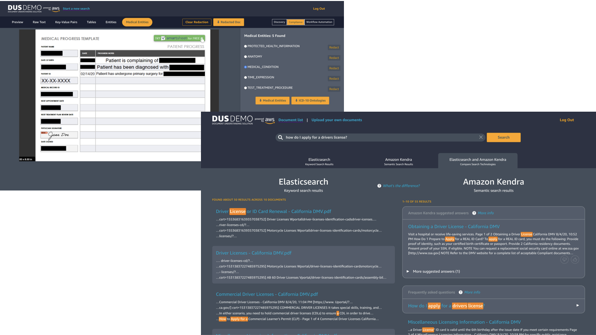
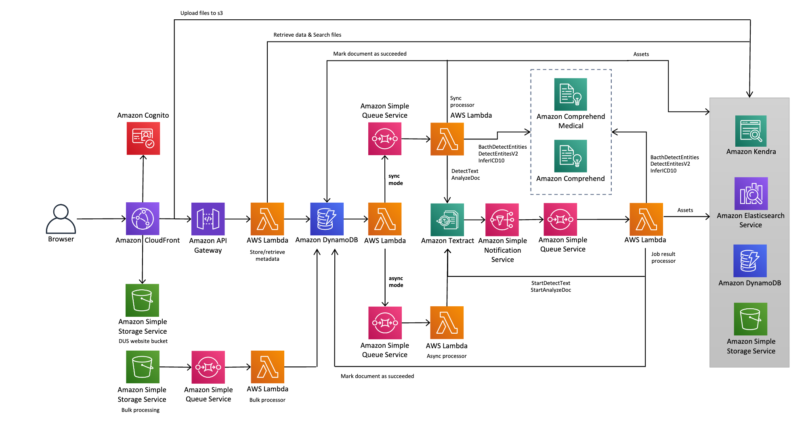

# Document Understanding Solution

DUS leverages the power of Amazon Textract, Amazon Comprehend , Amazon Comprehend Medical Amazon OpenSearch Service and Amazon Kendra to provide digitization , domain-specific data discovery, redaction controls , structural component extraction and other document processing & understanding capabilities.

## Architecture Diagram

### Note

Current document formats supported : **PDF,JPG,PNG**

Current maximum document file size supported : **150MB**

Current concurrent document uploads (via UI ) supported : **100**

## 1. CICD Deploy

### Requirements

- aws cli

  `sudo yum -y install aws-cli`

- pip3 (Required to install packages)

  `curl https://bootstrap.pypa.io/get-pip.py -o get-pip.py && python3 get-pip.py`

### Requirements

Please ensure you install all requirements before beginning the deployment

- aws cli

  `sudo yum -y install aws-cli`

- node 10+

  `sudo yum -y install nodejs`

- yarn

  `curl --silent --location https://dl.yarnpkg.com/rpm/yarn.repo | sudo tee /etc/yum.repos.d/yarn.repo`

  `sudo yum -y install yarn`

- tsc

  `npm install -g typescript`

- jq

  `sudo yum -y install jq`

- moto (Required for running the tests)
  `pip install moto==2.3.2`

- pip3 (Required to install packages)
  `curl https://bootstrap.pypa.io/get-pip.py -o get-pip.py && python3 get-pip.py`

To deploy using this approach, you must first set few values inside the `package.json` file in the `source` folder.

- Set your deployment region in the `stack->region` property, replacing `"%%REGION%%"`. This deployment will not pull the AWS region from your current AWS profile.
